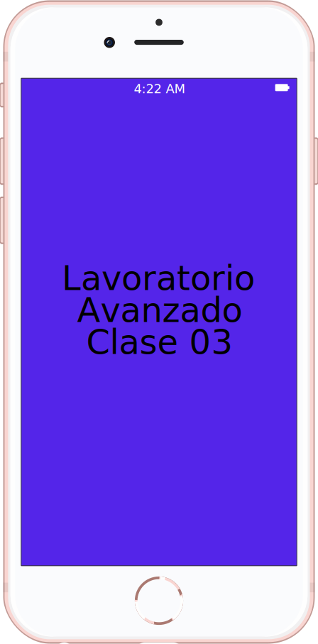
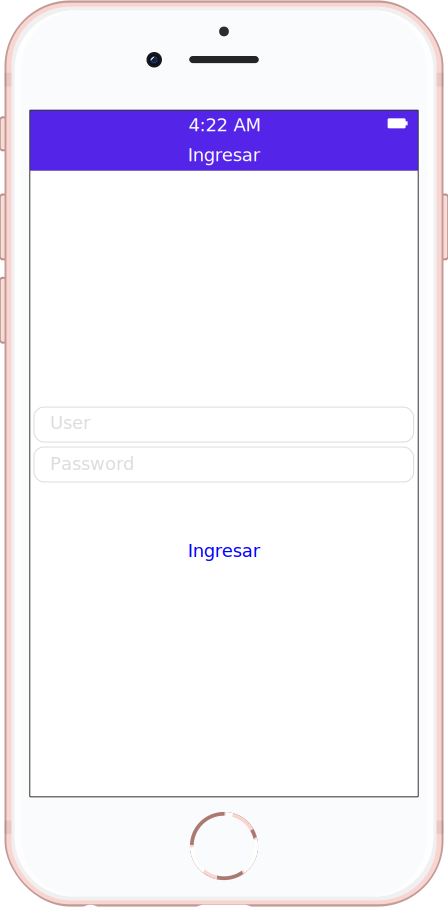
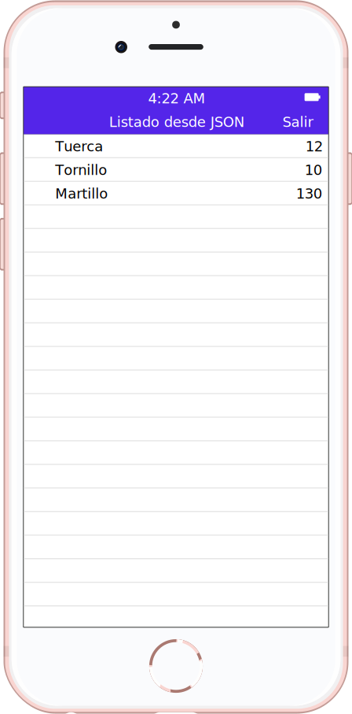

# Laboratorio 3

* Al ingresar se guarda localmente el usuario.
* Se muestra una lista de artículos de ferretería que se obtienen de un archivo JSON local.
* Si se vuelve a entrar y hay un usuario guardado localmente, se va directo al listado.
* Si desde el listado se hace tap en “Salir”, se borra el usuario guardado localmente y se vuelve a la pantalla de "Ingresar".

  

